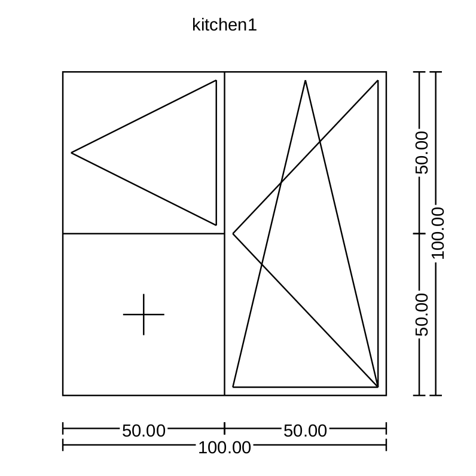

# window-specification-generator

Generate a pdf of window (physical windows, the ones that go into you house) specification from a JSON description.
In other words given this:
```
{
    "name": "example",
    "title": "Example",
    "windows": [
        {
            "name": "kitchen1",
            "width": 100,
            "height": 100,
            "division": {
                "type": "vertical",
                "pieces": [
                    {
                        "type": "horizontal",
                        "pieces": [
                            {"size": 30},
                            {"opens": "left"}
                        ]
                    },
                    {
                        "opens": ["top", "left"]
                    }
                ]
            }
        }
    ]
}
 ```

Generate this:


Useful if you want to ask for a price offer for a bunch of windows but don't feel like manually drawing them.

## Usage

```
./wsg.py /path/to/my-json-specification.json
```

## Dependencies

* [python3](https://www.python.org/)
* [reportlab](http://www.reportlab.com/) (available from pip)
